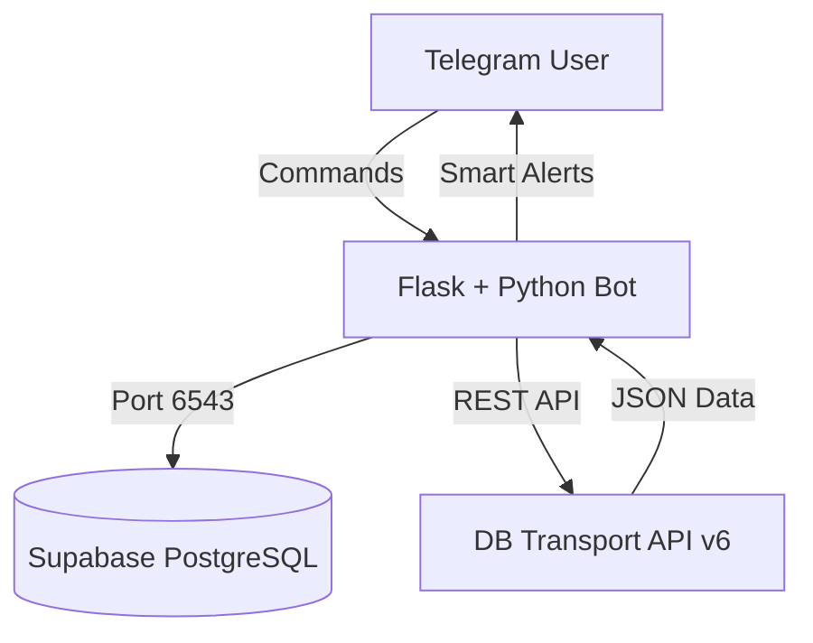

---

# 🚄 CommuteBot Pro (Hybrid SaaS Edition)

<div align="center">

<p align="center">
<b>Context-Aware • Dual-Track Monitoring • Zero-Latency Alerts</b>
</p>

</div>

---

## 🚀 Overview

**CommuteBot Pro** is an enterprise-grade rail assistant architected for the German Rail Network (Deutsche Bahn API v6). Unlike static scheduling tools, it employs a **Dynamic 80/20 Prediction Algorithm** to intelligently switch monitoring contexts between **Work** and **University** based on your shift schedule.

Designed as a **SaaS (Software as a Service)** solution, it supports multi-tenancy with isolated user profiles, IPv6-optimized database pooling, and 24/7 keep-alive architecture.

---

## ✨ Key Features

| Feature | Description |
| --- | --- |
| **🎓 Hybrid Tracking** | Seamlessly monitors **Workplace** and **University** commutes simultaneously. |
| **🧠 Smart Prediction** | Auto-switches direction based on your shift: <br>

<br>• **Morning:** Home ➔ Work/Uni <br>

<br>• **Evening:** Work/Uni ➔ Home |
| **⚡ Zero-Delay Logic** | Provides immediate "No Delay" confirmation or alerts for **Cancellations** & **Platform Changes**. |
| **🛡️ 24/7 Availability** | Built-in Flask Keep-Alive system to bypass cloud sleep timers (Render Free Tier compatible). |
| **🔌 Connection Pooling** | Uses Supabase Transaction Mode (Port 6543) for 100% stability on IPv6 networks. |

---

## 🏗️ System Architecture



---

## ⚙️ Installation & Deployment Guide

Follow this strictly to deploy the bot from scratch.

### 🔹 Phase 1: Telegram Bot Configuration

1. Open Telegram and search for **[@BotFather]()**.
2. Click **Start** and send `/newbot`.
3. Choose a Name and Username for your bot.
4. **Copy the API Token** (You will need this later).
5. Search for **[@userinfobot]()** and click **Start**.
6. Copy your numerical `Id` (This is your `ADMIN_ID`).

### 🔹 Phase 2: Database Setup (Supabase)

1. Create a project at **[Supabase.com]()**.
2. Navigate to the **SQL Editor** 📝 and execute:
```sql
CREATE TABLE users (
    chat_id BIGINT PRIMARY KEY,
    home_id TEXT, home_name TEXT,
    work_id TEXT, work_name TEXT,
    uni_id TEXT, uni_name TEXT,
    shift_type TEXT DEFAULT 'day',
    start_hour INT DEFAULT 8,
    created_at TIMESTAMP WITH TIME ZONE DEFAULT NOW()
);

```


3. Go to **Project Settings ⚙️ > Database > Connection Pooler**.
4. Set **Pool Mode** to `Transaction`.
5. Copy the **Connection String** and **change port `5432` to `6543**`.
> ⚠️ **Important:** You MUST use port **6543** to prevent "Network Unreachable" errors on Render.


### 🔹 Phase 3: Deploy to Render (Hosting)

1. Fork/Push this repository to **GitHub**.
2. Login to **[Render Dashboard]()**.
3. Click **New +** ➔ **Web Service** ➔ Connect your Repo.
4. **Build Settings:**
* **Runtime:** `Python 3`
* **Build Command:** `pip install -r requirements.txt`
* **Start Command:** `python bot.py`


5. **Environment Variables (Advanced Section):**
| Variable | Value |
| --- | --- |
| `TELEGRAM_TOKEN` | (Paste Token from BotFather) |
| `DATABASE_URL` | (Paste Supabase URI with Port 6543) |
| `ADMIN_ID` | (Paste your numeric ID) |
| `PORT` | `10000` |


### 🔹 Phase 4: Prevent Sleeping (Keep-Alive) 🟢

Render's free tier sleeps after 15 minutes. To keep it awake 24/7:

1. Copy your App URL: `https://your-app.onrender.com`.
2. Register at **[Cron-Job.org]()** (It's free).
3. Create a **CronJob**:
* **URL:** `https://your-app.onrender.com/`
* **Execution Schedule:** Every **14 minutes**.


4. Save. Your bot will now stay online indefinitely.

---

## 📱 User Guide

Once deployed, use these commands via the Menu button:

* `/start` — Initialize profile.
* `/check` — **Instant Status Check** (Work/Uni).
* `/sethome <city>` — Set Home Station.
* `/setwork <city>` — Set Work Station.
* `/setuni <city>` — Set University Station.
* `/time <hour>` — Set Shift Start (e.g., `/time 8`).
* `/mode` — Toggle Day/Night Shift.

---

## ⚖️ Disclaimer

This project integrates with the public **Deutsche Bahn API (v6)**. It is an open-source educational tool and is not affiliated with Deutsche Bahn AG.

---

<div align="center">

**Maintained by Chameesha Ravindu**


Licensed under MIT © 2026

</div>

---


දැන් කොහොමද මචං? මේක කෙලින්ම GitHub එකට දාමු! 🔥
